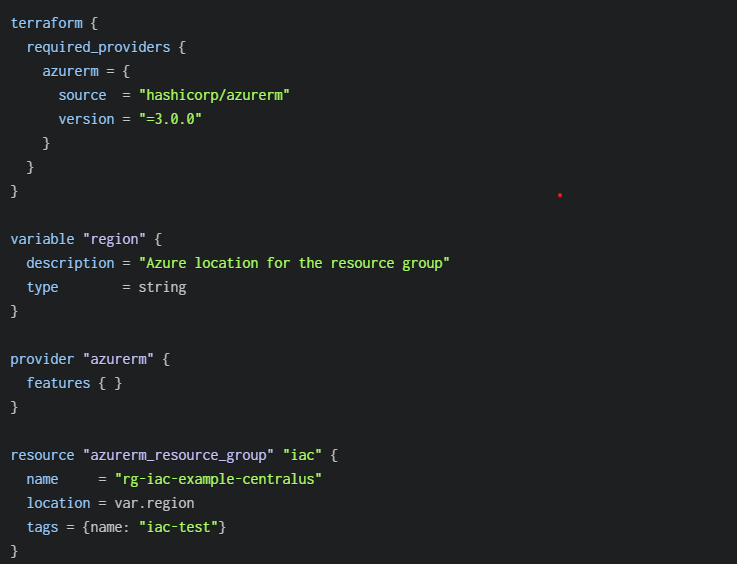
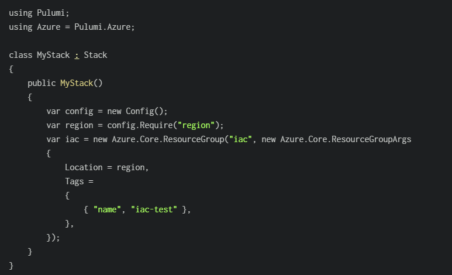
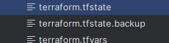
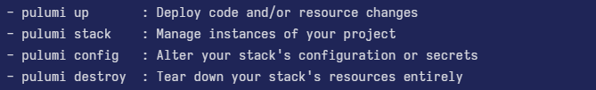
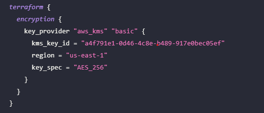

# IaC Competitors

## Terraform 
- Provider/Publisher: HashiCorp
- Language: HCL (HashiCorp Configuration Language)
- Purpose: Provision and manage infrastructure resources (multi-cloud and on-prem)
- License: BSL 1.1 from v1.5 onwards, previously MPL 2.0
- State Management: Uses a single state file (can be stored locally or remotely)


## Pulumi
- Provider/Publisher: Pulumi Corp.
- Language: Multiple programming languages (TypeScript, Python, Go, C#, Java, etc.)
- Purpose: Provision and manage infrastructure via an “Infrastructure as Software” approach
- License: Apache License 2.0 (Community Edition); additional commercial offerings
- State Management: Managed in the Pulumi Service (SaaS) or self-hosted (e.g., AWS S3, Git-based, etc.)


## AWS CloudFormation
- Provider/Publisher: Amazon Web Services (AWS)
- Language: JSON or YAML templates
- Purpose: Provision and manage AWS resources (primarily focused on AWS ecosystem)
- License: Proprietary (AWS service) – no additional cost for CloudFormation itself, but AWS usage fees apply
- State Management: Handled by AWS via “Stacks” stored within the CloudFormation service


## OpenTofu
- Provider/Publisher: Community-driven project (hosted under the Linux Foundation)
- Language: HCL (HashiCorp Configuration Language) / JSON
- Purpose: Provision and manage infrastructure resources across multiple providers; a fully open-source fork of Terraform
- License: MPL 2.0 (no BSL restrictions)
- State Management: Utilizes a state file (local or remote), analogous to Terraform


## Key Differences 
| Aspect                 | Terraform                                                                                                                    | Pulumi                                                                                | AWS CloudFormations                                                 | OpenTofu                                                                                           |
|------------------------|------------------------------------------------------------------------------------------------------------------------------|---------------------------------------------------------------------------------------|---------------------------------------------------------------------|----------------------------------------------------------------------------------------------------|
| Framework              | Standalone CLI tool                                                                                                          | CLI + optinal hosted services                                                         | AWS-native service for provisioning resources                       | Standalone CLI tool, community driven Terraform fork                                               |
| Configuration Language | HCL/JSON                                                                                                                     | Multiply languages (TypeScript/JavaScript, Python, Go, C#, Java, F#, YAML)            | YAML/JSON                                                           | HCL/JSON                                                                                           |
| Secret Management      | Secrets are stored in a seperate product(Vault)                                                                              | Secrets are encrypted in transit and in the state file                                | Deeply integrated in AWS Secres Manager and AWS SSM Parameter Store | Similar to terraform, no built-in store, recommended in a seperate product(vault)                  |
| State Handling         | Central state file, no state encryption,  supports remote backends (e.g S3)                                                  | State managed in Pulumi Service or self-hosted (e.g S3)                               | AWS manages state internally (no local files)                       | Central state file, supports remote backends, just like Terraform but has his own state encryption |
| Extensibility          | Providers & Modules Ecosystem                                                                                                | Native providers(e.g AWS,Azure,GCP) + Terraform providers via Pulumi Terraform Bridge | Supports macros, nested stacks, and custom resources (AWS scope)    | Providers and modules (mirrowing Terraform ecosystem)                                              |
| Execution Model        | CLI, imperative runs on command                                                                                              | Imperative CLI approach                                                               | Declarative stack-based, changes orchestrated by AWS                | Imperative runs on command                                                                         |
| Community Support      | Large established community, considered a standard in IaC                                                                    | Growing community                                                                     | Large AWS user base, official AWS support                           | New Project (2023+), quickly growing                                                               |
| Setup                  | Download Binary, add to PATH                                                                                                 | Install CLI, or sign up for Pulumi Service                                            | No local setup needed (AWS console or CLI), part of AWS ecosystem   | Download Binary, add to PATH                                                                       |
| Learning Curve         | Straightforward for entry-level IaC, many resources and documentations available,<br/> can be complex with advanced patterns | Familiar to developers comfortable with code, lesser documentation, but still growing | Easier for AWS users, can be complex, good AWS documentations       | Download Binary, add to PATH                                                                       |
| Licensing              | BSL 1.1 from v1.5 onwards, previously MPL 2.0                                                                                | Apache License 2.0                                                                    | Proprietary (AWS Service), AWS resource usage fees                  | Mozilla Public License 2.0, no BSL restrictions                                                    |


## Terraform vs Pulumi differences

- Terraform and Pulumi Language & Configurations difference:   
Terraform configuration example file to create Azure Resource Group with HCL language.  
  


- Same configuration file written in C# for Azure Resources  
  

  
- Terraform typically stores its state in a local terraform.tfstate file (though best practice is to use a remote backend like Azure Blob or S3 for collaboration).    

  

- Whereas Pulumi stores its state in the Pulumi Cloud by default, enabling “diff”-based reviews through its use of common development languages. It allows state storage in S3, Azure Blob or local files, similar to Terraform.


- When it comes to reusability, Terraform encourages the use of modules for organizing and sharing configurations, while Pulumi relies on standard programming constructs (functions, classes, packages) to enable code reuse, reflecting each tool’s approach to Infrastructure as Code.    

- While Terraform has no build in secret encryption and needs external services like S3 for it, Pulumi has a build-in secret encryption which is stored securely in the Pulumi state. It allows also external services if wanted.

- Basic CLI differences:
The command line interface to Terraform is the terraform command, which accepts a number of subcommands such as terraform init or terraform plan.  
  

For Pulumi it is similar how the CLI works.
To start working for Pulumi the command pulumi must be executed:

  

Other main commands:    
  


## Terraform vs OpenTofu differences
Since OpenTofu is fork of terraform and uses also the terraform eco system there are only few differences:
- OpenTofu Project was launched as a free alternative to Terraform after Terraform changed to BSL license. It mirrows terraform as fork but has not the BSL license restrictions.
- OpenTofu has its own encryption of the status files, which is not the case with Terraform.

Here a minimal configuration how to use the encryption:



- The OpenTofu looks exactly like terraform, because they both using HCL Language.


## Terraform vs AWS CloudFormations differences
- CloudFormations is limited to AWS-Only where Terraform supports multiple providers e.g AWS, Azure, GCP etc.
- Terraform uses HashiCorp Configuration Language (HCL), which is more expressive and allows custom modules, whereas CloudFormation relies on JSON/YAML, which can be verbose and harder to manage at scale.
- Terraform maintains a state file (terraform.tfstate), allowing better tracking of changes but requiring manual management, while CloudFormation inherently manages state within AWS without needing external storage.

AWS Cloud Formations doesnt need an extra, you use the AWS CLI or the AWS Console for it.

To create a stack from a template in the beginning:  
```
aws cloudformation create-stack --stack-name myteststack 
--template-body file://sampletemplate.json 
--parameters ParameterKey=KeyPairName,ParameterValue=TestKey ParameterKey=SubnetIDs,ParameterValue=SubnetID1\\,SubnetID2
```

For deploying a stack:
```
aws cloudformation deploy --stack-name myteststack \
  --template /path_to_template/my-template.json \
  --parameter-overrides Key1=Value1 Key2=Value2
```

To remove an existing stack and all associated resources:
```
aws cloudformation delete-stack \
    --stack-name my-stack
```

## Quick Pointers for Leaning Terraform
If you want getting started and dive into advanced terraform operations, the registry and the official HashiCorp tutorials are excellent resources to help you master Terraform.

- Official Registry
    - [registry.terraform.io](https://registry.terraform.io/) is the central place to discover and share Terraform providers, modules, policies, and more.
    - You can search by cloud provider (AWS, Azure, GCP) or functionality (e.g., Kubernetes, GitHub).
- Tutorials & Guides
    - [developer.hashicorp.com/terraform/tutorials](https://registry.terraform.io/) provides step-by-step tutorials, from beginner-level introductions to more advanced topics like modules and remote state.
- Providers
    - [registry.terraform.io/browse/providers](https://registry.terraform.io/) lists all official and community-managed providers. Each provider page includes documentation on usage, resource types, and examples.
- Modules
    - [registry.terraform.io/browse/modules](https://registry.terraform.io/) is where you can find reusable configurations (modules) for common tasks (e.g., VPC creation, AWS EC2 setup).
    - Download or reference modules directly in your .tf files to keep code DRY (Don’t Repeat Yourself).
- Policies:
    - [registry.terraform.io/browse/policies](https://registry.terraform.io/) highlights policies that can be enforced to meet compliance or security requirements, often used with Terraform Enterprise or Terraform Cloud.


## Sources
Terraform competitors:  
https://spacelift.io/blog/terraform-alternatives  

Pulumi vs Terraform:  
https://spacelift.io/blog/pulumi-vs-terraform  
https://www.pulumi.com/docs/iac/concepts/vs/terraform/  

OpenTofu vs Terraform:  
https://spacelift.io/blog/opentofu-vs-terraform  

ClaudFormation vs Terraform:  
https://spacelift.io/blog/terraform-vs-cloudformation  
https://www.env0.com/blog/terraform-vs-aws-cloudformation-an-in-depth-comparison

Terraform:  
https://www.terraform.io/
https://registry.terraform.io/browse/modules    
https://spacelift.io/blog/what-are-terraform-modules-and-how-do-they-work  
https://developer.hashicorp.com/terraform/cli/commands
https://spacelift.io/blog/terraform-secrets

OpenTofu:  
https://opentofu.org/docs/language/state/encryption/
https://opentofu.org/docs/cli/commands/  
https://opentofu.org/

Pulumi:  
https://www.pulumi.com/registry/  
https://www.pulumi.com/docs/iac/cli/
https://medium.com/@netopschic/provisioning-an-aws-ec2-instance-using-pulumi-34ff693a2d27
https://www.pulumi.com/docs/iac/concepts/secrets/
https://www.pulumi.com/tutorials/building-with-pulumi/secrets/

AWS CloudFormation:  
https://docs.aws.amazon.com/cli/latest/reference/cloudformation/  
https://docs.aws.amazon.com/AWSCloudFormation/latest/UserGuide/service_code_examples.html  
https://docs.aws.amazon.com/AWSCloudFormation/latest/UserGuide/aws-resource-secretsmanager-secret.html
https://docs.aws.amazon.com/secretsmanager/latest/userguide/security-encryption.html

Terraform Learn-Material:  
https://registry.terraform.io/  
https://developer.hashicorp.com/terraform/tutorials  
https://registry.terraform.io/browse/providers  
https://registry.terraform.io/browse/modules  
https://registry.terraform.io/browse/policies  


